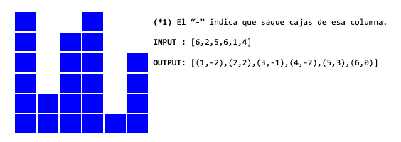

# Ejercicios de diseño de algoritmo

## Ejercicios de diseño de algoritmo

###### Distribución de Cajas 
Tengo cierta cantidad de cajas apiladas en columnas. Se asegura que la cantidad total de cajas es múltiplo de las columnas, de tal manera que se puedan formar columnas de igual tamaño.

Escriba un algoritmo que dada la cantidad de cajas en cada columna, indique cuántas cajas hay que mover para que todas las columnas tengan la misma cantidad de cajas.
Y además indicar el número (o índice) de columna en el cual se deben agregar o sacar dichas cajas (*1).
Para devolver esta información, utilizar la forma de lista de par ordenado (o tupla) como (Número de Columna y Cantidad)

###### String incluído
Dado 2 cadenas de caracteres, devuelve verdadero (true) si la segunda cadena está contenida en la primera, de lo contrario devuelve falso (false).
No utilizar funciones nativas del lenguaje, y en caso de hacerlo escribir la implementación.

Ejemplo: 
- (“Joven de Alto Vuelo“, “de Alto”) -> True
- (“Joven de“, “De Alto”) -> false
- (“Joven de AlDe Alto Vuelo“, “De Alto”) -> True

Escribir una solución en pseudocódigo imperativo y, de ser posible, una variante en funcional usando recursividad (considere usar funciones Cola y EsPrefijo).
