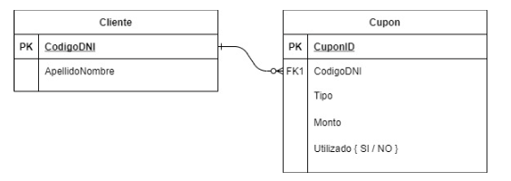
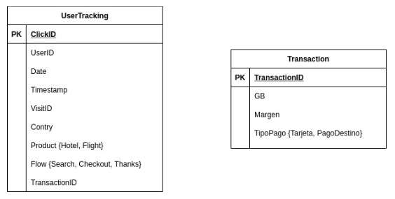

# Ejercicios de diseño de algoritmo

## Distribución de Cajas 

Tengo cierta cantidad de cajas apiladas en columnas. Se asegura que la cantidad total de cajas es múltiplo de las columnas, de tal manera que se puedan formar columnas de igual tamaño.

Escriba un algoritmo que dada la cantidad de cajas en cada columna, indique cuántas cajas hay que mover para que todas las columnas tengan la misma cantidad de cajas.
Y además indicar el número (o índice) de columna en el cual se deben agregar o sacar dichas cajas (*1).
Para devolver esta información, utilizar la forma de lista de par ordenado (o tupla) como (Número de Columna y Cantidad)

## String incluído
Dado 2 cadenas de caracteres, devuelve verdadero (true) si la segunda cadena está contenida en la primera, de lo contrario devuelve falso (false).
No utilizar funciones nativas del lenguaje, y en caso de hacerlo escribir la implementación.

Ejemplo: 
- (“Joven de Alto Vuelo“, “de Alto”) -> True
- (“Joven de“, “De Alto”) -> false
- (“Joven de AlDe Alto Vuelo“, “De Alto”) -> True

Escribir una solución en pseudocódigo imperativo y, de ser posible, una variante en funcional usando recursividad (considere usar funciones Cola y EsPrefijo).

# Ejercicios de Modelado

## SQL-1

La compañía Viajes S.A. vende noches de hotel y vuelos a través de su portal de internet en 10 países alrededor del mundo. En el portal se pueden buscar hoteles por destino y fecha de hospedaje (Check-in, Check-Out), además de los pasajes aéreos relacionados al viaje.

Cuando se compran vuelos y hoteles, se registra en el sistema de la compañía cada producto comprado de forma individual, aunque se hayan comprado en una misma transacción.

Al registrarse ambos productos comprados, cada uno puede terminar en un estado diferente (EMITIDO o CANCELADO) según la disponibilidad real en el proveedor al momento de la compra.

Además, se registran para cada una de ellas los intentos de cobro, que pueden tener estado “ERROR” u “OK”.
1. Modelar el mínimo de entidades (con sus atributos) para resolver la consulta requerida en el punto 2. Indicar la relación entre las entidades creadas.
2. Confeccionar una consulta SQL para el reporte de cobros, que liste “Monto cobrado OK, por país, de productos emitidos”
3. Además, la compañía ofrece cupones de descuento nominales, y se registran en un sistema cuyo modelo de datos es el siguiente:

Confeccionar una consulta SQL que liste los Clientes (lista de ApellidoNombre) que hayan utilizado 5 Ó 6 Cupones.

## SQL-2

La compañía Viajes S.A. necesita contar con métricas que le permitan entender el comportamiento de los diferentes tipos de usuarios en su sitio WEB, para esto desarrolla un sistema de trackeo que registra la interacción de los usuarios en el sitio.

La estructura de tracking es la siguiente:

**Nota:** *La tabla Transaction está poblada con información del sistema transaccional de la empresa, como las tablas provienen de sistemas diferentes pueden existir transacciones que estén registradas en el sistema pero NO trackeadas.*

1. Explique con sus propias palabras, una posible interpretación del modelo, dar ejemplos del contenido de la tabla UserTracking.
2. Detallar un posible contenido de la tabla que represente la navegación de un usuario que el lunes hizo 3 búsquedas de Vuelos, llegó hasta el checkout en el 3er intento y desistió, el miércoles entró directo al checkout, luego compró y continuó buscando Hoteles.
3. Confeccionar una consulta SQL que calcule el “convertion rate” diario por país y producto de la página de búsqueda y de la página del Checkout.
4. Los usuarios desean que las ventas usadas para calcular el “convertion rate” coincidan exactamente con los reportes de ventas corporativos, confeccione una consulta SQL para satisfacer la necesidad.

En los últimos tiempos Viajes S.A. tuvo un importante crecimiento que se ve reflejado directamente en el volumen de la información a procesar.
1. Qué tipo de tecnología/arquitectura considera debería adoptar esta empresa?
2. Qué tipo de estrategia debería seguirse para que tanto usuarios Analistas como Managers puedan trabajar con la información?

# Ejercicio Relevamiento / QA

Usted ha ganado la licitación para colocar una máquina expendedora de gaseosas dentro de la compañía petrolera Piedrita SA. Para este emprendimiento, ha adquirido un nuevo modelo de máquina expendedora.
Liste, en orden de importancia (primero el más importante), las 5 pruebas que usted realizaría antes de dejar la máquina instalada y en funcionamiento. Justifique el orden.

# Ejercicio conocimiento de QlikView
Explique con sus propias palabras, en lenguaje coloquial, el funcionamiento de las siguientes cláusulas o funciones de scripting QV:
- AUTOGENERATE() + RecNo()
- PEEK
- EXISTS y NOT EXISTS (con 1 y 2 campos) / lectura optimizada
- INTERVALMATCH
- Distintas formas de uso de $(=)

# Preguntas Técnicas Generales
Explique con sus propias palabras, en lenguaje coloquial, situaciones donde aplique usar distintas estrategias de modelado

1. Modelo Estrella
2. Link tables - relacional
3. Modelado no relacional
4. ¿Qué ventajas nos da la nube?
5. ¿Qué diferencias hay entre una DB OLTP vs OLAP?
6. Diferencias bases de datos columnares vs bases de datos en filas
   - ¿qué ventajas tiene cada una?
   - ¿cómo se modelan los datos en cada una de estas db?
   - ¿normalizado vs desnormalizado de tablas?
7. ¿Para qué sirve un archivo parquet?
8. ¿Cómo migrarías una base de datos a otro servidor, teniendo en cuenta que la base fuente no se puede apagar?
9. Haz el diseño de Netflix/Spotify (ABM tablas SQL, Sesiones Redis, videos/música buckets, metadata música nosql, etc)

